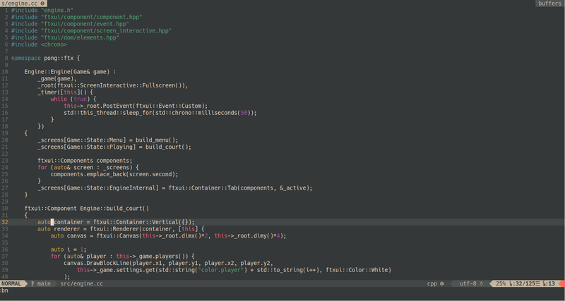
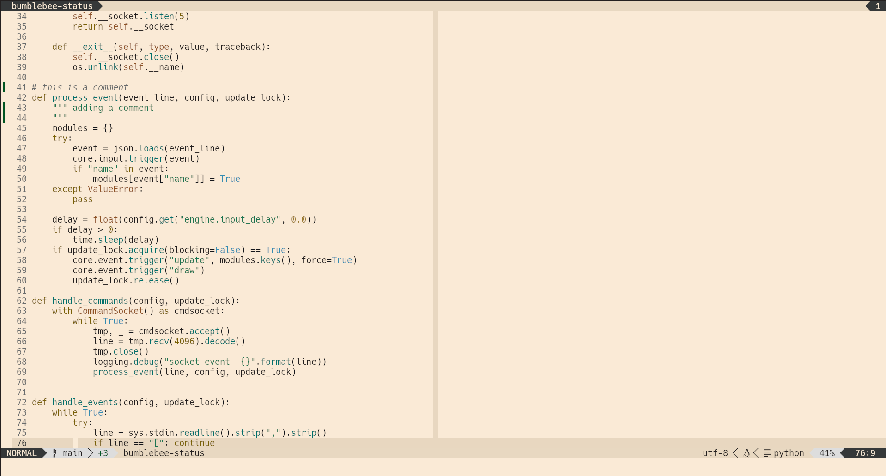

ZenGarden is a color scheme for neovim that tries to be
calm and relaxing, while still retaining some important properties
from color theory (contrast, uniform lightness, uniform chromma).

This colorscheme is created with [lush](https://github.com/rktjmp/lush.nvim),
and therefore depends on it.

# Screenshots




# Installation

## Packer

```
  use { "tobi-wan-kenobi/zengarden",
    requires = "rktjmp/lush.nvim",
    config = function()
      vim.cmd [[ colorscheme zengarden ]]
    end
  }
```

## Configuration

Optionally, you can call `setup()` on the module to set parameters:

```
  use { "tobi-wan-kenobi/zengarden",
    requires = "rktjmp/lush.nvim",
    config = function()
        require("zengarden").setup({
            variant = "yellow"
        })
      vim.cmd [[ colorscheme zengarden ]]
    end
  }
```

Currently, you can set the following parameters:

* `variant`: sets highlight colors for float, menu, etc. to one of: `yellow` (the default),
    `cyan`, `orange`, `magenta`, `green`
* `italics`: whether italics should be used (default) or not, boolean value

# Palette

## Dark

* Chroma = 0.1
* Lightness = 65 (73 for light)

| Purpose          | Color Name      | Hex Value | OKLCH | Contrast (background) |
| ---------------- | --------------- | --------- | ----- | --------------------- |
| background       | Basalt          | `#242020`   | - | - |
| background (alt) | Jet             | `#343434`   | - | - |
| foreground       | Ivory           | `#faebd7`   | - | - |
| foreground (dim) | Almond (dim)    | `#e8d8c1`   | - | - |
| blue (base)      | Pond            | `#4e98c5`   | 65/0.1/237.69 | 5.08 |
| blue (light)     | Lake            | `#5fb3db`   | 73/0.1/230.94 | 6.87 |
| red (base)       | Coral           | `#c57673`   | 65/0.1/22.51  | 4.77 |
| red (light)      | Terracotta      | `#df907f`   | 73/0.1/32.77  | 6.47 |
| green (base)     | Bamboo          | `#50a27c`   | 65/0.1/161.7  | 5.22 |
| green (light)    | Shamrock        | `#74ba8b`   | 73/0.1/153.91 | 7.01 |
| yellow (base)    | Sand            | `#a78c41`   | 65/0.1/89.59  | 4.96 |
| yellow (light)   | Triandra Grass  | `#c4a35a`   | 73/0.1/85.55  | 6.7  |
| magenta (base)   | Lavender        | `#a27ebd`   | 65/0.1/309.94 | 4.8  |
| magenta (light)  | Bright Lavender | `#b997d9`   | 73/0.1/307.6  | 6.51 |
| cyan (base)      | Sea Green       | `#31a39a`   | 65/0.1/187.33 | 5.24 |
| cyan (light)     | Verdigris       | `#4ebcb7`   | 73/0.1/191.06 | 7.06 |
| orange (base)    | Clay            | `#bf7e52`   | 65/0.1/54.12  | 4.85 |
| orange (light)   | Fallen Leaves   | `#d09c5f`   | 73/0.1/69.6   | 6.6  |
| -                | Sakura          | `#c57675`   | 65/0.1/20.92  | 4.77 |
| -                | Lotus           | `#c1758b`   | 65/0.1/1.51   | 4.74 |
| -                | Sunset          | `#c47865`   | 65/0.1/34.83  | 4.77 |
| -                | Sunray          | `#919549`   | 65/0.1/111.56 | 5.06 |
| -                | Old Wood        | `#c17b59`   | 65/0.1/46.38  | 4.79 |
| -                | Red Wood        | `#c07c56`   | 65/0.1/49.51  | 4.8  |
| -                | Cherry          | `#c57579`   | 65/0.1/17.0.1 | 4.75 |
| -                | Jade            | `#54a279`   | 65/0.1/158.93 | 5.23 |

## Light

* Chroma = 0.1
* Lightness = 50 (60 for light)

| Purpose          | Color Name      | Hex Value | OKLCH | Contrast (background) |
| ---------------- | --------------- | --------- | ----- | --------------------- |
| background       | Basalt          | `#242020`   | - | - |
| background (alt) | Jet             | `#343434`   | - | - |
| foreground       | Ivory           | `#faebd7`   | - | - |
| foreground (dim) | Almond (dim)    | `#e8d8c1`   | - | - |
| blue (base)      | Pond            | `#4e98c5`   | | |
| blue (light)     | Lake            | `#5fb3db`   | | |
| red (base)       | Coral           | `#c57673`   | | |
| red (light)      | Terracotta      | `#df907f`   | | |
| green (base)     | Bamboo          | `#50a27c`   | | |
| green (light)    | Shamrock        | `#74ba8b`   | | |
| yellow (base)    | Sand            | `#a78c41`   | | |
| yellow (light)   | Triandra Grass  | `#c4a35a`   | | |
| magenta (base)   | Lavender        | `#a27ebd`   | | |
| magenta (light)  | Bright Lavender | `#b997d9`   | | |
| cyan (base)      | Sea Green       | `#31a39a`   | | |
| cyan (light)     | Verdigris       | `#4ebcb7`   | | |
| orange (base)    | Clay            | `#bf7e52`   | | |
| orange (light)   | Fallen Leaves   | `#d09c5f`   | | |
| -                | Sakura          | `#c57675`   | | |
| -                | Lotus           | `#c1758b`   | | |
| -                | Sunset          | `#c47865`   | | |
| -                | Sunray          | `#919549`   | | |
| -                | Old Wood        | `#c17b59`   | | |
| -                | Red Wood        | `#c07c56`   | | |
| -                | Cherry          | `#c57579`   | | |
| -                | Jade            | `#54a279`   | | |


# Design

My attempt was to create a colorscheme by following color theory (to the extent I understand it).

After some research, I settled on OKLCH, which defines "perceived" lightness and chroma (roughly saturation). Keeping lightness and chroma consistent across accent colors *should* result in a harmonous over appearance.

Additionally, care was taken to keep contrast above the WCAG recommendation of 4.5:1.

