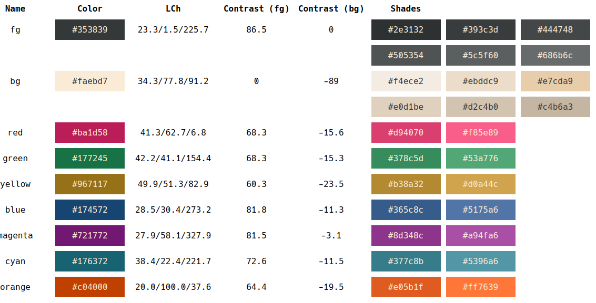

ZenGarden is a color scheme for neovim that tries to be
calm and relaxing, while still retaining some important properties
from color theory (contrast, uniform lightness).

This colorscheme is created with [lush](https://github.com/rktjmp/lush.nvim),
and therefore depends on it.

It is ... uh ... "heavily influenced" by [gruvbox](https://github.com/morhetz/gruvbox), which
is an excellent colorscheme.

The colors are designed primarily with the light color scheme in mind (contrast), but the dark
version also works (with lighter shades of accents).

# Screenshots


# Installation

## Packer

```
  use { "tobi-wan-kenobi/zengarden",
    requires = "rktjmp/lush.nvim",
    config = function()
      vim.cmd [[ colorscheme zengarden ]]
    end
  }
```

## Configuration

Optionally, you can call `setup()` on the module to set parameters:

```
  use { "tobi-wan-kenobi/zengarden",
    requires = "rktjmp/lush.nvim",
    config = function()
        require("zengarden").setup({
            variant = "yellow"
        })
      vim.cmd [[ colorscheme zengarden ]]
    end
  }
```

Currently, you can set the following parameters:

* `variant`: sets highlight colors for float, menu, etc. to one of: `cyan` (the default),
    `yellow`, `orange`, `magenta`, `green`
* `italics`: whether italics should be used (default) or not, boolean value

# Palette

| Purpose         | Color Name | Hex Value | OKLCH | Contrast (black) | Contrast (white) |
| --------------- | ---------- | --------- | --- | ---------------- | ---------------- |
| black           | Black Chestnut | #252321 | 25.76/0/67.61          | 0     | 13.36 |
| white           | Ivory      | #faebd7   | 94.76/0.031/75.22  | - | 0     |
| grey            | Gravel     | #686b6c   | 52.55/0.004/219.56 | - | 4.58  |
| red (dark)      | Brick      | #b62625   | 50.68/0.18/26.81 | - | 5.44 |
| blue (dark)     | Sapphire   | #1a5bc4   | 49.65/0.176/260.01 | - | 5.37 |
| green (dark)    | Emerald    | #196f18   | 47.39/0.144/142.83 | - | 5.38 |
| yellow (dark)   | Bronze     | #94601e   | 53.37/0.104/67.43 | - | 4.53 |
| orange (dark)   | Mahagony   | #c04000   | 54.85/0.173/39.51 | - | 4.51 |
| magenta (dark)  | Orchid     | #9932cc   | 54.11/0.227/311.51 | - | 4.86 |
| cyan (dark)     | Teal       | #007575   | 50.92/0.087/194.77 | - | 4.71 |
| ???    | Bamboo     | #076745   | 45.46/0.098/161.47 | - | 5.9 |
| ???      | Cherry     | #a52138   | 47.52/0.166/17.4   | - | 6.23  |
| red (light)     | Coral      | #ff7c7c   | 73.79/0.16/21.74   | 6.28 | - |
| blue (light)    | Pond       | #79b4da   | 74.36/0.08/237.63  | 6.97 | - |
| green (light)   | Jade       | #38c283   | 72.48/0.14/158.77  | 6.68 | - |
| yellow (light)  | Sand       | #baaf43   | 74.28/0.128/103.36 | 6.93 | - |
| orange (light)  | Daylily    | #ff8936   | 74.79/0.169/41.48  | 6.62 | - |
| magenta (light) | Flamingo   | #f56df6   | 74.76/0.229/327.24 | 6.26 | - |
| cyan (light)    | Verdigris  | #4bb9b4   | 72.25/0.1/190.95 | 6.63 | - |
| ???         | Sakura     | #ffa7a6   | 81.47/0.104/20.29  | 8.44  | - |
| ???         | Amber      | #ffbf00   | 84.03/0.172/84.08 | 9.47 | - |




# Design

:warning: I am a software developer, not a designer, and it seriously
shows in this color scheme :P

Since I have 0 creative talent, I attempted to approach the color scheme design scientifically,
by finding out what objective measures are available. Spoiler: I did not find a lot of data.

During my "research" (= searching around in the web), I found a couple of suggestions
that informed me on how to design this color scheme:

* The general consensus *seems* to be that light background is easier on the eye
* Some posts/discussions indicated that blue light *might* be harmful for prolonged exposure,
  for various reasons (one being that it changes the sleep rhythm, and another one that short
  wave lengths possibly penetrate deeper into the eye).
* High contrast - a no-brainer at last! - is important for relaxed reading.

(Note to self: I should prolly come up with references to back up those claims)

So here's the plan I came up with:

* For color selection, use CIE-LCh instead of RGB or HSV, because it emphasizes perceptual
  uniformity. This means that - at least in theory - two colors with the same value for "lightness"
  will be perceived as ... well ... similar in lightness, independent of their hues.
* Use only accent colors that have high contrast (I used [Colour Contrast Tool](https://cliambrown.com/contrast/)).
  Generally, I aimed for a contrast around 70, more for colors on the blue end of the spectrum.
* For blue-ish colors (blue, cyan, also magenta), reduce lightness a bit more. I did this primarily
  because the colors appealed more to me subjectively.
* For lighter/darker colors, the only thing I changed was to increase/decrease the "lightness" value by 10.
