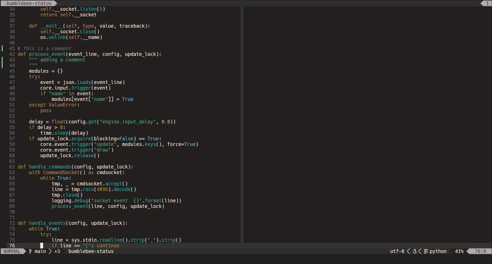

ZenGarden is a color scheme for neovim that tries to be
calm and relaxing, while still retaining some important properties
from color theory (contrast, uniform lightness, uniform chromma).

This colorscheme is created with [lush](https://github.com/rktjmp/lush.nvim),
and therefore depends on it.

# Screenshots




# Installation

## Packer

```
  use { "tobi-wan-kenobi/zengarden",
    requires = "rktjmp/lush.nvim",
    config = function()
      vim.cmd [[ colorscheme zengarden ]]
    end
  }
```

## Configuration

Optionally, you can call `setup()` on the module to set parameters:

```
  use { "tobi-wan-kenobi/zengarden",
    requires = "rktjmp/lush.nvim",
    config = function()
        require("zengarden").setup({
            variant = "yellow"
        })
      vim.cmd [[ colorscheme zengarden ]]
    end
  }
```

Currently, you can set the following parameters:

* `variant`: sets highlight colors for float, menu, etc. to one of: `cyan` (the default),
    `yellow`, `orange`, `magenta`, `green`
* `italics`: whether italics should be used (default) or not, boolean value

# 
## Dark
Chroma = 0.1
Lightness = 65 (73 for light)

| Purpose         | Color Name      | Hex Value | OKLCH | Contrast (background) |
| --------------- | --------------- | --------- | ----- | --------------------- |
| background      | Basalt          | #242020   | - | - |
| foreground      | Ivory           | #faebd7   | - | - |
| blue (base)     | Pond            | #79b4da   | 65.44/0.08/237.83 | 5.14 |
| blue (light)    | Lake            | #7aa8bf   | 70.69/0.06/230.29 | 6.28 |
| red (base)      | Coral           | #ff4040   | 65.97/0.23/26.03  | 4.65 |
| red (light)     | Terracotta      | #e2725b   | 67.74/0.14/32.94  | 5.21 |
| green (base)    | Jade            | #00a86b   | 64.48/0.15/158.78 | 5.23 |
| green (light)   | Shamrock        | #5fa778   | 66.81/0.10/154.08 | 5.59 |
| yellow (base)   | Goldenrod       | #daa520   | 75.16/0.15/83.99  | 7.2 |
| yellow (light)  | Triandra Grass  | #e2b13c   | 78.51/0.14/85.05  | 8.12 |
| magenta (base)  | Lavender        | #b57edc   | 68.44/0.15/309.99 | 5.36 |
| magenta (light) | Bright Lavender | #bf94e4   | 73.58/0.12/308.3  | 6.58 |
| cyan (base)     | Sea Green       | #00a59d   | 65.08/0.11/188.7  | 5.27 |
| cyan (light)    | Verdigris       | #43b3ae   | 70.25/0.1/190.95  | 6.37 |

## Light
Chroma = 0.1
Lightness = 50 (60 for light)

| Purpose         | Color Name      | Hex Value | OKLCH | Contrast (background) |
| --------------- | --------------- | --------- | ----- | --------------------- |
| background      | Ivory           | #faebd7   | - | - |
| foreground      | Basalt           | #242020   | - | - |
| blue (base)     | Pond | #1a6b95 | - | - |


# Design

:warning: I am a software developer, not a designer, and it seriously
shows in this color scheme :P

My attempt was to create a colorscheme by following color theory (to the extent I understand it).

After some research, I settled on OKLCH, which defines "perceived" lightness and chroma (roughly saturation). Keeping lightness and chroma consistent across accent colors *should* result in a harmonous over appearance.

Additionally, care was taken to keep contrast above the WCAG recommendation of 4.5:1.

